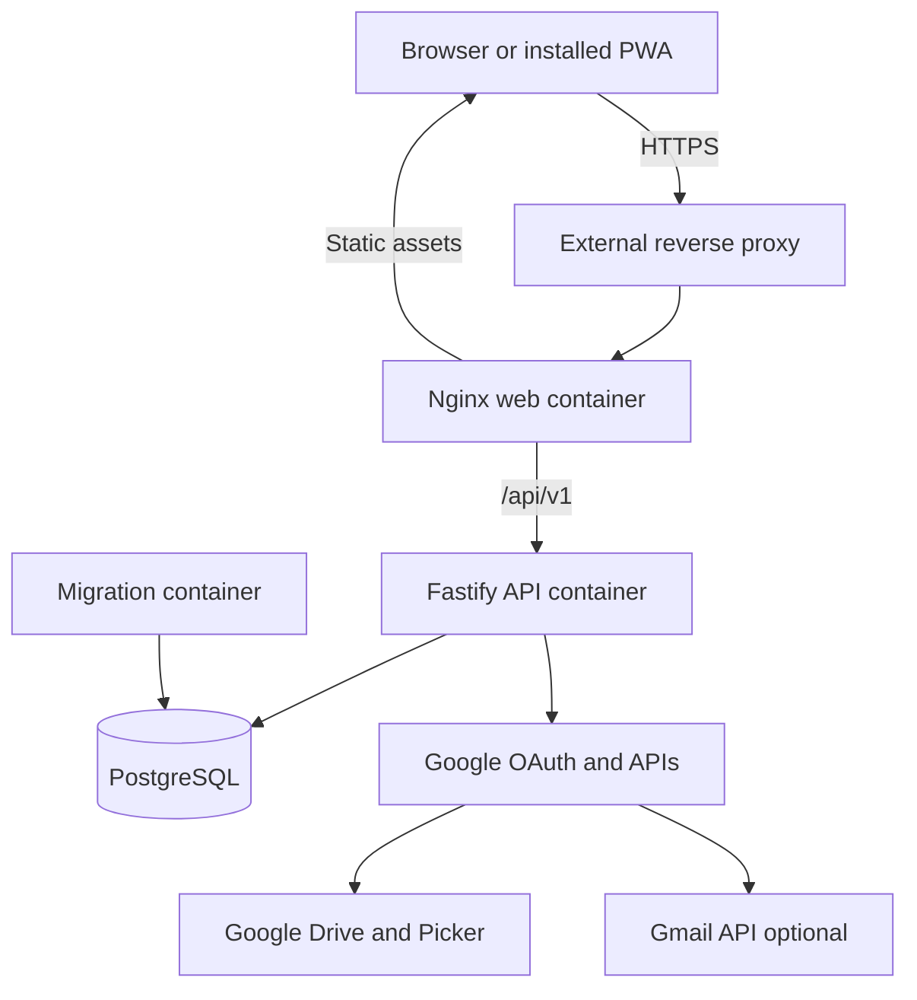

# Woko architecture

## Overview

Woko is an npm-workspace monorepo with a React PWA, a Fastify API, a PostgreSQL database, and a shared TypeScript domain package. The production Docker stack serves the web application through Nginx and proxies same-origin API traffic to Fastify.

## Components

### `apps/web`

- React 19 and Vite application
- Mobile-first responsive interface
- Bahasa Indonesia and English localization
- PWA manifest and auto-updating service worker
- Production Nginx image
- Same-origin `/api` reverse proxy to the API container

### `apps/api`

- Fastify HTTP API under `/api/v1`
- Google OAuth/OIDC login and database-backed sessions
- Work-order, notification, report, and administration routes
- PostgreSQL migrations and seed command
- Drive/Picker and optional Gmail integrations
- In-process PostgreSQL-backed scheduler and worker
- Liveness at `/health/live` and readiness at `/health/ready`

### `packages/domain`

- Shared roles, stages, priorities, conditions, and schemas
- Work-order creation validation
- Internal and vendor transition rules
- Deadline grouping and work-order number generation
- Shared behavior used by API and web workspaces

### PostgreSQL

PostgreSQL is the system of record for users, sessions, work orders, participants, workflow history, audit events, evidence metadata, notifications, jobs, locations, and organization settings. Schema changes are applied through ordered SQL files in `apps/api/migrations/`.

### Google Workspace

- OAuth authenticates users from the configured domain.
- Picker allows users to select files with per-file authorization.
- Drive stores work-order evidence in the configured Shared Drive hierarchy.
- Gmail optionally sends queued notification emails through a dedicated service account with domain-wide delegation.

## Request flow

1. The browser requests the PWA from Nginx.
2. The browser calls same-origin `/api/v1/...` endpoints.
3. Nginx forwards `/api/` traffic to `api:3001`.
4. Fastify validates the session, role, origin, and payload.
5. The API reads or changes PostgreSQL state and records relevant updates/audit events.
6. Integration actions call Google APIs when required.
7. Fastify returns a JSON result to the web client.

Same-origin production routing is important because authenticated mutations enforce the `APP_BASE_URL` origin and production cookies use the secure flag.

## Authentication and authorization

Woko uses the Google authorization-code flow with PKCE, nonce, and state validation. The API verifies identity claims and the allowed hosted domain before creating an opaque session. Only a hash of the session token is stored in PostgreSQL; the raw token is held in an HTTP-only cookie.

Authorization combines global roles and work-order participation:

- Administrators manage users and organization settings.
- Administrators and facilities managers perform management approvals and broader workflow changes.
- PICs can create work orders and operate assigned work within workflow policy.
- Workers are globally eligible for internal assignment, but assignment only grants visibility, discussion, Drive access, and `IN_PROGRESS` progress updates. It never grants workflow-transition authority.
- Reviewers and overseers receive contextual visibility and discussion access according to route policy.

## Workflow integrity

The shared domain package defines separate ordered workflows for internal and vendor work. API actions use expected-version values to reject stale writes, while structured actions enforce proposal, scheduling, review, and completion requirements. Material actions create timeline updates and immutable audit records.

## Evidence model

Attachments carry an action context (`INITIAL`, `PROGRESS_UPDATE`, `VENDOR_PROPOSAL`, `INTERNAL_PROCUREMENT`, or `COMPLETION`) and lifecycle state. Business actions reference their attachment IDs so files appear with the timeline event they support; the detail evidence card is read-only.

Woko stores file metadata and work-order relationships in PostgreSQL while Google Drive stores file content. A dedicated service account is the only application identity with access to the private project Shared Drive area. For Picker-selected files, Woko grants the Drive worker `writer` access to maintain file-level sharing, grants every active work-card participant `writer` access to the original file, and creates a shortcut in the correct private work-order subfolder. The original file remains in place, and application users are not shared onto the Shared Drive itself.

The API limits evidence uploads/selections by evidence type, file count, size, MIME type, and extension. Current maximum file size is 15 MiB per file.

## Internal procurement

Each internal work order has one current procurement state record. PICs/managers can require and submit a proposal through the external Finance process; managers record the communicated decision. Unresolved procurement blocks submission to review unless a manager stores an explicit override reason in the timeline and immutable audit history.

## Notifications and background jobs

The API process contains a scheduler and queue worker by default. Jobs are persisted in PostgreSQL and use:

- `FOR UPDATE SKIP LOCKED` claiming
- idempotency keys
- exponential retry backoff
- stale-lock recovery
- configurable polling, scheduling interval, and batch size

This permits multiple API replicas to share work safely, although the supplied Compose file runs one API container. Set `BACKGROUND_JOBS_ENABLED=false` on API replicas only when another process explicitly owns scheduling and delivery.

## Deployment architecture

The supplied `compose.yaml` starts services in dependency order:

1. `postgres` becomes healthy.
2. `migrate` builds the API image and applies all pending migrations.
3. `api` starts after successful migration and becomes ready after a database check.
4. `web` starts after the API becomes healthy.

The web image is the only application service published to the host. PostgreSQL is bound to loopback by default; the API is reachable externally only through the web proxy.

## Security controls

- Production test-auth guard
- Secure, HTTP-only, same-site cookies
- Same-origin mutation validation
- Hosted-domain enforcement
- Role and participant authorization
- Zod input validation
- Multipart size and count limits
- Helmet and explicit content security policy
- API rate limiting
- Nginx security headers
- Non-root API runtime user
- Docker secrets for service-account JSON mounts
- Database-backed audit history

Infrastructure still owns HTTPS termination, host patching, firewalling, secret storage, database backup, log retention, and monitoring.

## Important operational characteristics

- The current Compose design is single-host and uses a named PostgreSQL volume.
- The database is not published publicly unless the host binding is changed.
- Migrations run automatically during full Compose startup and must succeed before the API starts.
- Web assets are compiled with `VITE_API_URL=/api/v1` for same-origin production access.
- Service workers auto-update, while Nginx avoids long caching for `index.html` and `sw.js`.
- Real credentials and service-account files must remain outside the repository.
