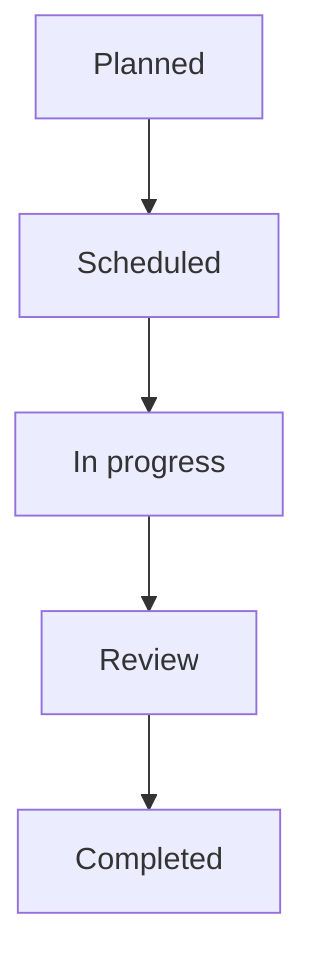
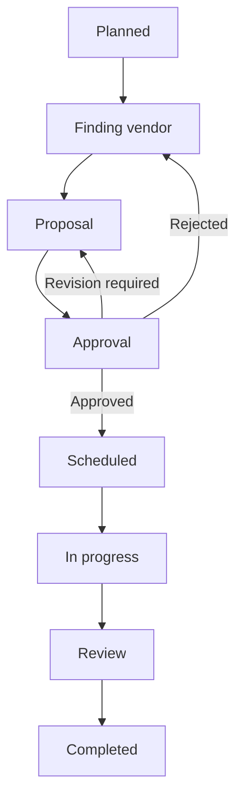

# Woko product requirements document

**Product:** Woko  
**Release:** v0.6.0
**Status:** Release-ready for controlled internal production use  
**Primary organization:** Millennia World School

## 1. Product summary

Woko is a mobile-first work-order system for planning, assigning, tracking, reviewing, and auditing school facilities work. It gives facilities teams one shared operational record for internal jobs and vendor-managed work while keeping due dates, responsibility, evidence, approvals, and communication visible.

## 2. Problem statement

Facilities work can become fragmented across chat, email, spreadsheets, verbal requests, and Drive folders. That makes it difficult to answer:

- What work is active, overdue, blocked, or waiting for approval?
- Who is responsible for execution, review, or oversight?
- What changed, who changed it, and why?
- Has a vendor proposal or completion evidence been supplied?
- Which locations, categories, and assignees account for current workload?

Woko centralizes these answers while retaining Google Workspace as the organization's identity and file platform.

## 3. Goals

1. Provide a reliable shared work-order register for facilities operations.
2. Make ownership, due dates, risk, and workflow stage visible on mobile and desktop.
3. Enforce consistent internal and vendor workflows.
4. Preserve a traceable history of material actions and decisions.
5. Deliver timely in-app reminders, with optional Gmail delivery.
6. Support management reporting without maintaining a parallel spreadsheet.
7. Fit the organization's Google Workspace identity and Drive practices.

## 4. Non-goals for v0.1

- Public or customer self-service requests
- Multi-tenant SaaS operation
- Native iOS or Android applications
- Offline mutation or conflict resolution
- Inventory, procurement, invoicing, or payment processing
- Vendor accounts or a vendor-facing portal
- Advanced analytics, scheduled report delivery, or custom dashboards
- Automatic high-availability database failover

## 5. Users and roles

| Role | Primary needs |
| --- | --- |
| Administrator | Manage access, organization settings, locations, and all operational work |
| Facilities Manager | Plan work, assign participants, approve vendor proposals, review completion, and monitor operations |
| Person in Charge (PIC) | Create work orders, execute assigned work, post progress, manage internal procurement submissions, flag risk/blockers, and advance permitted stages |
| Worker | Assist a PIC on internal work, post progress evidence while work is in progress, and participate in discussion without transition or completion authority |
| Overseer | Follow relevant work and participate in progress discussions without owning execution or approval |

A person may hold multiple roles. Access remains restricted to active internal users authenticated through the configured Google Workspace domain.

## 6. Core workflows

### 6.1 Internal work

PICs normally move work one step forward. Managers can make exceptional jumps or backward transitions when a reason is recorded. Completion requires manager authorization, and movement to review requires a completion summary. Completion evidence is required unless an explicit waiver reason is recorded.

### 6.2 Vendor work

Vendor discovery, proposal submission, and proposal decisions use structured actions. Proposal evidence is required before approval. An approved proposal requires a planned start date.

## 7. Functional requirements

### 7.1 Authentication and access

- Authenticate users with Google authorization code flow.
- Restrict identities to the configured Workspace domain.
- Maintain opaque, server-side sessions in PostgreSQL.
- Allow the first verified domain identity to bootstrap the initial administrator only when no internal users exist.
- Require administrators to register and activate subsequent users.
- Prevent test authentication in production.

### 7.2 Work-order management

- Allow Administrators, Facilities Managers, and PICs to create internal or vendor work orders with title, description, category, location, PICs, internal workers, reviewer, overseers, priority, due date, execution constraints, and plan summary.
- Generate human-readable work-order numbers.
- Present work grouped by deadline, including overdue and archived work.
- Search work orders and provide “all work” and “my work” views.
- Permit authorized participant and due-date changes with recorded history.
- Track active, completed, and cancelled status.

### 7.3 Progress, risk, and approvals

- Validate workflow transitions by work type and role.
- Track on-track, at-risk, and blocked conditions.
- Require structured explanations for risk, blockers, and resolution.
- Support vendor search, proposal submission, approval, rejection, and revision requests.
- Support completion review and manager approval.
- Track internal procurement proposal submission to the external Finance process and the communicated Finance decision.
- Block internal completion submission while procurement is unresolved unless a manager records an explicit override reason.
- Prevent stale concurrent updates through expected-version checks.

### 7.4 Evidence and collaboration

- Store evidence metadata in Woko and files in Google Drive.
- Support initial, progress, vendor proposal, internal procurement, and completion evidence through action-specific attachment contexts.
- Offer both local upload and Google Drive selection for action-specific attachment inputs.
- Keep the work-order evidence card read-only; files are attached through the business action they support.
- Allow users to select permitted Drive files through Google Picker.
- Move files into the project Shared Drive when policy allows, with a user-approved copy fallback.
- Show progress updates, attached evidence, and participant discussions in the work-order timeline.
- Retain immutable audit/event records for material actions.

### 7.5 Notifications

- Provide durable in-app notifications.
- Optionally send notification email through Gmail API.
- Schedule reminders in the configured application time zone.
- Cover approaching due dates, due today, overdue work, and workflow events.
- Retry transient delivery failures and retain delivery state.
- Support multiple API replicas through database locking and idempotency.

### 7.6 Reporting and administration

- Report summary counts and breakdowns by assignee, category, location, work type, and academic year.
- Filter reports by date range, location, category, assignee, and work type.
- Allow administrators to manage users, locations, and organization work settings.
- Support bilingual user preference for Bahasa Indonesia and English.

## 8. Non-functional requirements

### Security

- Use HTTPS in production.
- Store secrets outside version control.
- Use secure, HTTP-only, same-site session cookies in production.
- Validate request payloads and uploaded file constraints.
- Enforce role checks and same-origin mutation requests.
- Apply security headers and API rate limiting.

### Reliability

- Persist application state in PostgreSQL.
- Run schema migrations before starting the API.
- Expose liveness and database-backed readiness endpoints.
- Use persistent queues with retry, stale-lock recovery, and idempotency.
- Maintain database backups and a tested restore procedure.

### Usability

- Support current mobile and desktop browsers.
- Be installable as a PWA.
- Provide Bahasa Indonesia and English UI modes.
- Keep primary operational actions usable on small screens.

### Maintainability

- Share workflow types and validation through the domain workspace.
- Keep schema changes in ordered SQL migrations.
- Require type checking, automated tests, and production builds before release.

## 9. External dependencies

- PostgreSQL 17
- Google Cloud OAuth client
- Google Workspace domain administration
- Google Drive API and Google Picker API
- Shared Drive and configured root folder
- Optional Gmail API service account with domain-wide delegation
- HTTPS reverse proxy and DNS for production

## 10. Success measures

The v0.1 release should be considered successful when:

- Facilities work is created and maintained primarily in Woko rather than a parallel tracker.
- Every active work order has visible ownership and a due date.
- Managers can identify overdue, blocked, and approval-pending work from the application.
- Vendor proposal and completion decisions have supporting history and evidence.
- Notification processing operates without silently losing jobs.
- Administrators can onboard users and maintain locations without database intervention.
- Production backups and restoration have been tested.

Quantitative baselines should be captured during the controlled rollout before setting improvement targets for later releases.

## 11. v0.1 acceptance criteria

- All repository type checks, tests, and builds pass.
- A clean PostgreSQL database can run all migrations and seed data.
- Production Compose services become healthy after startup.
- Google sign-in succeeds for an allowed and registered identity.
- A manager can create and complete an internal work order.
- A vendor work order can pass through proposal approval to completion.
- Evidence can be attached through the configured Drive integration.
- In-app notifications are generated; Gmail delivery works when enabled.
- Reports return current work-order data and filters.
- Unauthorized users and role-ineligible actions are rejected.

## 12. Known boundaries and future considerations

- v0.1 is designed for a single organization and configured Workspace domain.
- PostgreSQL, Drive, Google identity, and optional Gmail are operational dependencies.
- Docker Compose provides a single-host deployment foundation, not automatic HA.
- File availability and ownership behavior depend on Google Workspace and Shared Drive policy.
- PWA assets can be cached by clients; releases should preserve the configured cache-control and service-worker update behavior.
- Future releases may add richer analytics, scheduled exports, vendor participation, inventory/procurement links, and stronger multi-instance infrastructure.
